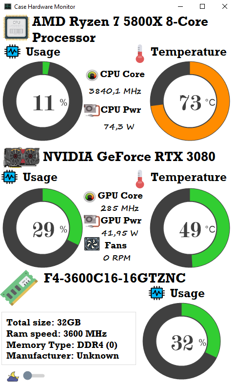

A visual studio project for a 800x480 raspberry pi display placed inside a physical computer case vertically (480x800) to show informations (Usage,Temprature,Clocks,Power) about CPU,GPU and Memory. OpenHardwareMonitor library and ManagementObjectSearcher are used to get those informations.

